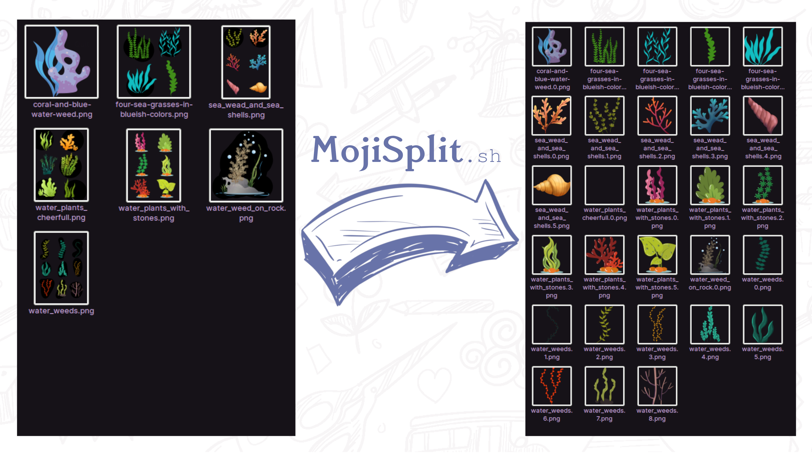
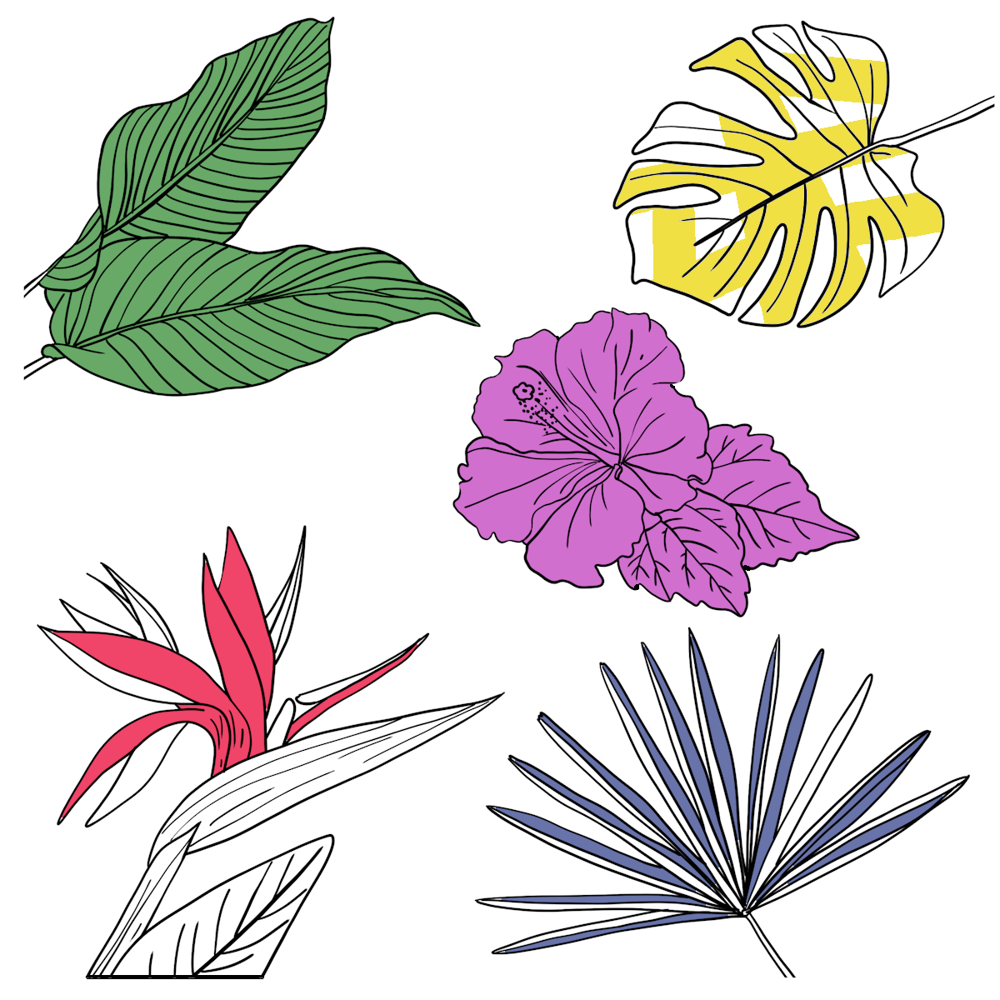
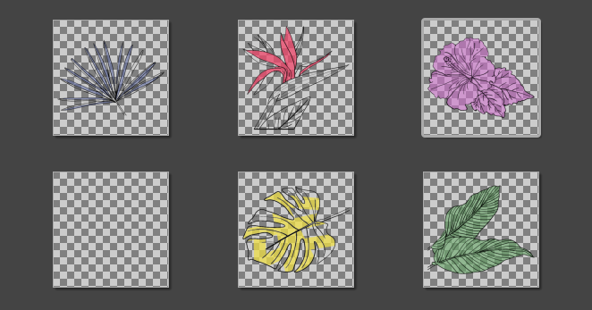

<!--  -->


If you ever made an emoji or an emote pack (for example for mastodon, a forum or a messanger) from a stock image sheet containing multiple cliparts, you know how tedious it is:<br/>
You need to separate all of them from each other (which might be more difficult than just using a rectangle selection tool and cutting if they are somehow entangled);
you need to crop them all to 512px (or whatever size your system needs);
and you might need to make their background transparent and not forget to have a 16px (or smth) margin around the image.

MojiSplit automates this process for you - you give it some images with an even background and with one or more doodles, cliparts, icons or emojis on it, and it takes on the tasks detailed above for you.
The result is a folder full of images of the individual elements in good emoji-size with good emoji-padding.



<details><summary>Example of an image sheet (input)</summary>



`input.png`
</details>

<details><summary>Example of the individual images extracted from it (output)</summary>



`input.0.png` - `input.5.png`
</details>

<details><summary>More on Image -> Output</summary>

**The input image(s)**:
* The tool expects your image to have a uniform background (ideally transparent; see [here](#usage) for more options about this).
* Different parts of your image may have overlapping bounding boxes.
* Elements in your image may have holes in them.

**The output images**:
* transparent background.
* 512x512 px large (a power of two and exactly the size that Signal messanger wants for stickers, coincidentally).
* 16px padding between their border and the border of their contents.

(there are options to customize most of this)
</details>

## Installation

### Linux (offline):

1. Clone the repository (or download it, it doesn't matter)
2. Install `imagemagick` (`>=v6.9.12-14`)
   
   <details><summary>Installation instructions in case you don't have it yet</summary>
   
   See [here](https://mindaslab.github.io/2018/11/22/install-latest-version-of-imagemagick-in-ubuntu-18-04.html) for installation instructions if you don't already have it, and use [this link]() instead of the one mentioned in the article to get the aforementioned version.</details>
3. Navigate into the cloned folder and execute one of the command detailed in the [Commands](#commands_available) section.

### Other OSs (online with GitHub actions)

1. Fork the repository & clone your fork
2. Make your fork an independent copy (in the GitHub repository settings) and make it private
3. Add the images you would like the convert to the `inputs` directory, and the command(s) you would like to execute into `command.sh`.
4. Push these changes.
5. The finished emojis should now be in the `finished-emojis` branch, which you can then pull or download from directly to get them.

## Usage

**Basic usage**:

```bash
./mojisplit.sh inp out
```

where `inp` is the input and `out` the output.

If `inp` is an image file, only this image is used as an input, whereas if `inp` is a directory, every image within this directory will be used as an input.

If `out` is a PNG file name (ends with `.png` or `.PNG`), the resulting images will be merged into one image in a clear raster shape;
otherwise, the resulting images wil be stored in the directory `out` (will be created if there is none yet, and overwrite any pre-existing directory if there is one under the same name already).

**Optional arguments**:

* `--background <some_color>`:
  
  replaces a specific color with transparency in the beginning (smooth).
  This is necessary if your images aren't on a transparent background.

* `--background2 <some_color>`:

  Specifies a color that will also be replaced with transparency in the end, but which will still be counted as non-transparent when cutting the image.<br/>
  You can use this color to show the tool that some non-connected parts of your image belong together by pre-editing the image to give them a connecting background in this color.
  
* `--pxsize <size_as_integer>`

  Allows you to customize the width and height of the resulting images.<br/>
  Defaults to 512px.

* `--padding <padding_as_integer>`

  Allows you to customize the padding between the resulting images' content and their border.<br/>
  Defaults to 16px.
  
* `--maxsize <max_size_of_the_resulting_images>`

  Some applications don't require a specific image width and height, but have a specific file size limit for their emojis.
  This option allows you to specify a max file size, and every output image will be scaled down and optimized to fit this file size.
  
  Note that said optimization has `optipng` as an optional dependency (as simple as `sudo apt-get install optipng` on most systems);
  otherwise, the max size will be ensured by resizing without any additional optimizations.
  
  Values consist of an integer and `KB`, `MB` or `GB` (without any space between number and unit) or no unit at all, which indicates that they are byte measurements.

  This step is optimized to run in <code>O(log<sub>2</sub> n)</code>, where `n` is the size of the image for which we want to find the biggest pixel size that fits within a given file size, in case you are wondering about the performance of this.
<!--
* `--keep-holes-filled-with-bg-color <true or false>`

  If set to `true` (the default is `false`), this option ensures that "holes" within emojis that are filled with the background color (as specified by `--background`) keep this background color rather than become transparent.<br/>
  This can be useful for example  if you have black line art on an even white background, and you want every part of the background to be transparent except for the parts surrounded by lines (the "inside" of the lineart).
  The example image further up the page, for example, would've profited greatly from this.
-->
**Please note**:

The tool can take some minutes to run;
please be patient with it!

## Images used

The images I used for demonstration purposes in this repository are the following:
* <a href='https://pngtree.com/so/tropical-plants'>tropical plants png from pngtree.com</a>
* <a href='https://www.freepik.com/vectors/floral'>Floral vector created by Harryarts - www.freepik.com</a>
* [Hand drawn arrow](https://thenounproject.com/term/hand-drawn-arrow/1724691) by Marcel Dornis from [the Noun Project](https://thenounproject.com) for the array used in the reddit post on [r/bash](https://reddit.com/r/bash) and the array in the graphic above.

Aquatic plants used in the graphic above:
<ul>
<li><a href='https://pngtree.com/so/seaweed-clipart'>seaweed clipart png from pngtree.com</a></li>
<li><a href='https://pngtree.com/so/coral-clipart'>coral clipart png from pngtree.com</a></li>
<li><a href='https://pngtree.com/so/cartoon'>cartoon png from pngtree.com</a></li>
<li><a href='https://pngtree.com/so/under-the-sea-clipart'>under the sea clipart png from pngtree.com</a></li>
<li><a href='https://pngtree.com/so/coral-clipart'>coral clipart png from pngtree.com</a></li>
<li><a href='https://pngtree.com/so/child-creature'>child creature png from pngtree.com</a></li>
<li><a href='https://pngtree.com/so/creative-simplicity'>creative simplicity png from pngtree.com</a></li>
<li><a href='https://pngtree.com/so/under-the-sea-clipart'>under the sea clipart png from pngtree.com</a></li>
</ul>

## Code used

I used code from the following StackOverflow-answers and blog posts:
* [This](https://stackoverflow.com/a/29758578) answer on how to get masks for the individual objects in the picture.
* [This](https://stackoverflow.com/questions/13648943/masking-an-images-alpha-in-imagemagick) answer on how to mask (I didn't take code from it, though).
* [This](https://stackoverflow.com/a/27194202) answer on how to convert a color to alpha (including its code).
* [This](https://askubuntu.com/a/594979) answer on how to fit an image into a square (including its code).
* [This](https://stackoverflow.com/a/14203146) answer on how to extract extended arguments from the command line.
* [This](http://redsymbol.net/articles/bash-exit-traps/) blog post on how to make cleanup functions for bash scripts.

## Further reading:
* I postet about this project [on r/bash](https://www.reddit.com/r/bash/comments/o4zidm/i_wrote_a_script_to_split_an_image_consisting_of/) on Reddit.

## License

This code is licensed under the MIT license, except for the images used, which are not licensed at all since they are stock images that I am not allowed to re-license.

See [here](LICENSE.txt) for the license text.